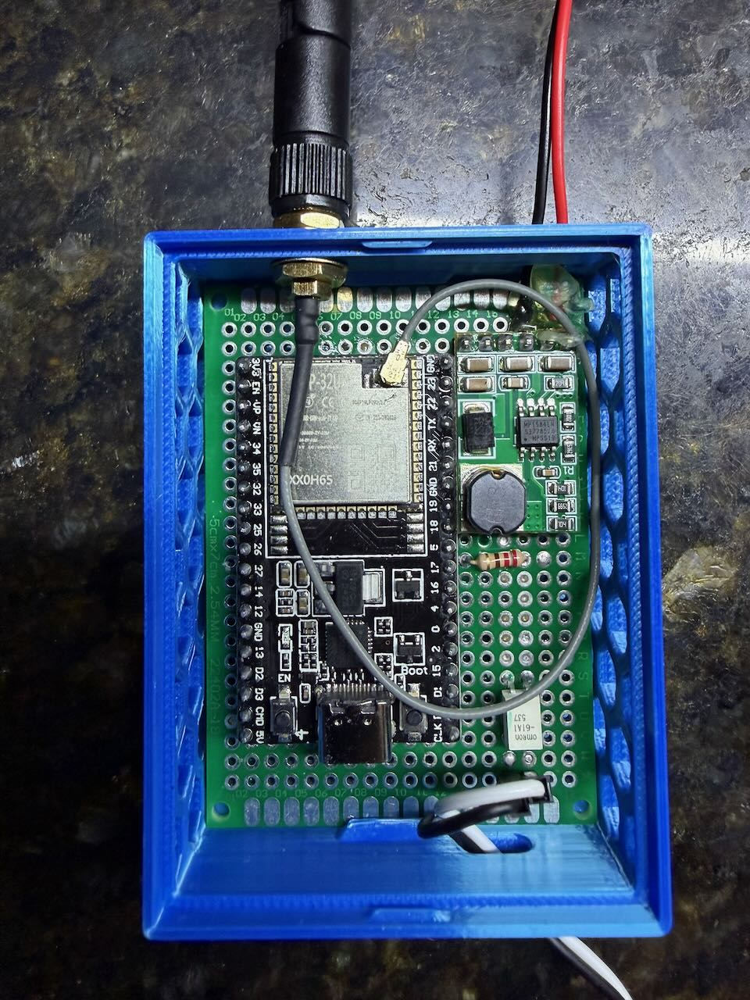

# Garage Door Controller — Marantec Comfort 280

ESP32-based smart garage door controller for the **Marantec Comfort 280** opener. Runs ESPHome firmware, integrates with Home Assistant, and is exposed to Apple HomeKit via Homebridge.

Fully local — no cloud dependency. Self-powered from the opener's own 24V DC auxiliary rail.

---

## Features

- Open / close / stop from Home Assistant dashboard or Apple Home
- Appears as a native garage door accessory in HomeKit
- Bluetooth proxy — extends Home Assistant Bluetooth range
- Galvanically isolated trigger (G3VM-61A1 MOSFET SSR)
- Self-powered from Marantec 24V rail via MP1584EN buck converter

---



---

## Hardware

| Component | Part | Notes |
|---|---|---|
| Microcontroller | ESP32U (esp32dev) | WiFi + BT, soldered protoboard build |
| Solid State Relay | OMRON G3VM-61A1 | SOP-4; galvanic isolation between ESP and Marantec |
| Current limit resistor | 220Ω | SSR LED drive ~10mA |
| Buck converter | MP1584EN (preset 5V) | 24V → 5V, powers ESP32 from Marantec rail |
| Reed switches | NO magnetic contact sensors | GPIO4 (closed), GPIO5 (open) — planned |

---

## Architecture

```
Apple Home / Siri
    ↕  HomeKit (Homebridge)
Home Assistant
    ↕  ESPHome Native API (encrypted, local WiFi)
ESP32U
    GPIO17 → 220Ω → G3VM-61A1 → Marantec XB03 pin 1+3  (impulse trigger)
    GPIO4  ← reed switch (door CLOSED)                  [planned]
    GPIO5  ← reed switch (door OPEN)                    [planned]
    5V     ← MP1584EN ← Marantec XB03 pin 2 (24V)
```

---

## Wiring


See [`breadboard.md`](breadboard.md) for full wiring diagrams and bench test procedure.

### Marantec XB03 Terminal Block

```
[ 3 ][ 1 ][ 2 ][ 4 ][ 70 ][ 71 ]
```

| Terminal | Function | Connection |
|---|---|---|
| 1 | Impulse input | G3VM pin 3 or 4 |
| 2 | 24V DC output | MP1584EN IN+ |
| 3 | GND | G3VM pin 3 or 4; MP1584EN IN− |
| 70/71 | Photocell safety | Do not touch |

---

## Firmware

### Prerequisites

- [ESPHome](https://esphome.io) installed
- `secrets.yaml` in project root (see `secrets.example.yaml`)

### secrets.yaml

```yaml
wifi_ssid: "your_ssid"
wifi_password: "your_password"
ap_fallback_password: "your_fallback_password"
esphome_api_key: "your_base64_api_key"
ota_password: "your_ota_password"
```

Generate the API key:
```bash
python3 -c "import secrets, base64; print(base64.b64encode(secrets.token_bytes(32)).decode())"
```

### Flash

```bash
esphome run garage_door.yaml
```

Subsequent updates are OTA over WiFi.

---

## HomeKit via Homebridge

The [Homebridge addon](https://github.com/homebridge/homebridge-homeassistant) runs inside Home Assistant — no separate server or access token required.

1. Install the **Homebridge** addon from the Home Assistant addon store
2. Start the addon and open the Homebridge UI from the HA sidebar
3. Open the **Home** app on iPhone and add an accessory
4. Scan the QR code displayed in the Homebridge UI
5. Homebridge appears as a bridge in HomeKit and exposes selected HA entities

Entity filtering is configured through the Homebridge UI — toggle individual entities on or off to control what appears in HomeKit.

---

## Repository Structure

```
garage_door.yaml          # ESPHome firmware
secrets.example.yaml      # Secrets template
garage_door_automation.md # Full design document
breadboard.md             # Wiring guide and bench test procedure
Board/                    # Fritzing layout files
Case/                     # 3D print files (base + lid STL)
Reference/                # Datasheets and reference images
```

---

## Roadmap

- [ ] Install reed switches (GPIO4 closed, GPIO5 open) for real-time state feedback
- [ ] Replace optimistic cover with sensor-driven state lambda
- [ ] Mount in 3D printed enclosure
- [ ] Install in garage
