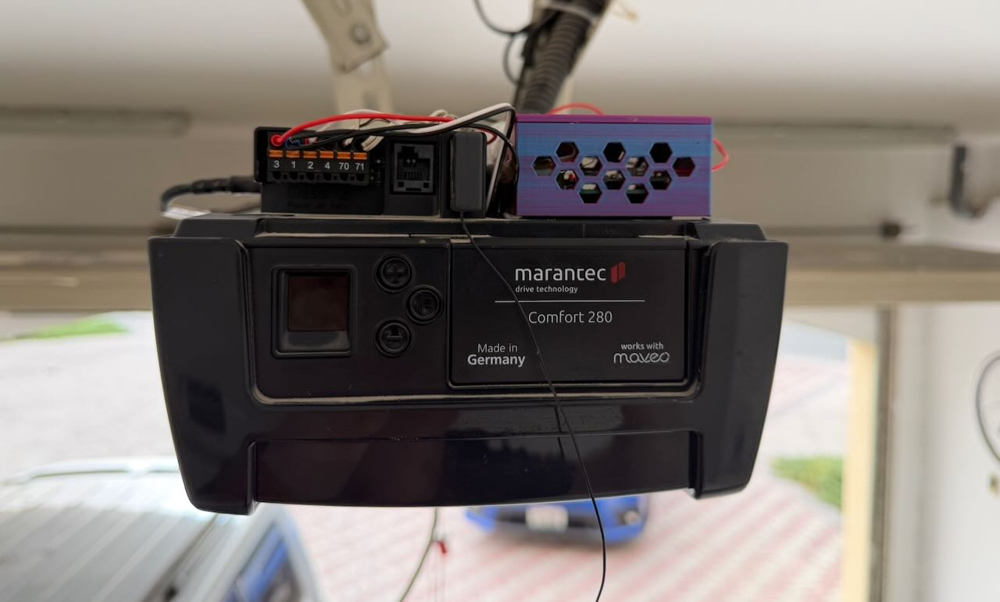

# Garage Door Controller — Home Assistant and HomeKit Integration

Smart garage door controller for the **Marantec Comfort 280** opener. Runs ESPHome firmware, integrates with Home Assistant, and is exposed to Apple HomeKit via Homebridge.

Two published hardware variants — pick the one that suits your install:

| Variant | Firmware | Board | Notes |
|---|---|---|---|
| ESP32-C3 Super Mini | `garage_door_esp32-c3.yaml` | ESP32-C3 Super Mini | Compact; esp-idf framework |
| ESP32U External Antenna | `garage_door_esp32.yaml` | ESP32U (ESP32dev) | External antenna for better range; Arduino framework |

Fully local — no cloud dependency. Self-powered from the opener's own 24V DC auxiliary rail.



---

## Features

- Open / close / stop from Home Assistant dashboard or Apple Home
- Appears as a native garage door accessory in HomeKit
- Real-time door state via VL53L0X time-of-flight sensor (no door wiring required)
- Galvanically isolated trigger (G3VM-61A1 MOSFET SSR)
- Self-powered from Marantec 24V rail via buck converter

---

## Hardware

| Component | Part | ESP32-C3 variant | ESP32U variant |
|---|---|---|---|
| Microcontroller | — | ESP32-C3 Super Mini (`esp32-c3-devkitm-1`) | ESP32U (`esp32dev`) |
| Solid State Relay | OMRON G3VM-61A1 | SOP-4; galvanic isolation | SOP-4; galvanic isolation |
| Current limit resistor | 220Ω | SSR LED drive ~10mA | SSR LED drive ~10mA |
| Buck converter | Mini 5605V (preset 5V) | 24V → 5V | 24V → 5V |
| Distance sensor | CJVL53L0XV2 (VL53L0X breakout) | I2C, 3.3V, ceiling-mounted | I2C, 3.3V, ceiling-mounted |

---

## Architecture

### ESP32-C3 Super Mini

```
Apple Home / Siri
    ↕  HomeKit (Homebridge)
Home Assistant
    ↕  ESPHome Native API (encrypted, local WiFi)
ESP32-C3 Super Mini
    GPIO7  → 220Ω → G3VM-61A1 → Marantec XB03 terminals 1+2  (impulse trigger)
    GPIO1 (SDA) / GPIO3 (SCL) → I2C 10kHz → CJVL53L0XV2 (ceiling-mounted)
    5V  ← Mini 5605V buck converter ← Marantec XB03 terminal 3 (24V)
```

### ESP32U External Antenna

```
Apple Home / Siri
    ↕  HomeKit (Homebridge)
Home Assistant
    ↕  ESPHome Native API (encrypted, local WiFi)
ESP32U (esp32dev)
    GPIO17 → 220Ω → G3VM-61A1 → Marantec XB03 terminals 1+2  (impulse trigger)
    GPIO26 (SDA) / GPIO27 (SCL) → I2C 10kHz → CJVL53L0XV2 (ceiling-mounted)
    5V  ← Mini 5605V buck converter ← Marantec XB03 terminal 3 (24V)
```

---

## Wiring

See [`hardware.md`](hardware.md) for the bill of materials and full wiring diagrams.

### Marantec XB03 Terminal Block

```
[ 3 ][ 1 ][ 2 ][ 4 ][ 70 ][ 71 ]
```

| Terminal | Function | Connection |
|---|---|---|
| 1 | GND | G3VM pin 3 or 4; buck converter IN− |
| 2 | Pulse input | G3VM pin 3 or 4 |
| 3 | 24V DC output | Buck converter IN+ |
| 70/71 | Photocell safety | Do not touch |

---

## Firmware

### Prerequisites

- [ESPHome](https://esphome.io) installed
- `secrets.yaml` in project root (see `secrets.example.yaml`)

### secrets.yaml

```yaml
wifi_ssid: "your_ssid"
wifi_password: "your_password"
ap_fallback_password: "your_fallback_password"
esphome_api_key: "your_base64_api_key"
ota_password: "your_ota_password"
```

Generate the API key:
```bash
python3 -c "import secrets, base64; print(base64.b64encode(secrets.token_bytes(32)).decode())"
```

### Flash

```bash
# ESP32-C3 Super Mini
esphome run garage_door_esp32-c3.yaml

# ESP32U External Antenna
esphome run garage_door_esp32.yaml
```

Subsequent updates are OTA over WiFi.

---

## HomeKit via Homebridge

The [Homebridge addon](https://github.com/homebridge/homebridge-homeassistant) runs inside Home Assistant.

1. Install the **Homebridge** addon from the Home Assistant addon store
2. Start the addon and open the Homebridge UI from the HA sidebar
3. Open the **Home** app on iPhone and add an accessory
4. Scan the QR code displayed in the Homebridge UI

---

## Repository Structure

```
garage_door_esp32-c3.yaml  # ESP32-C3 Super Mini firmware
garage_door_esp32.yaml     # ESP32U external antenna firmware
hardware.md                # Bill of materials and wiring guide
secrets.example.yaml       # Secrets template
Board/                     # Fritzing layout files
3DPrint/                   # 3D print files (STL, source, mounts)
```
